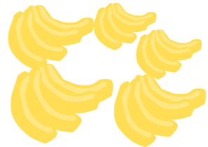
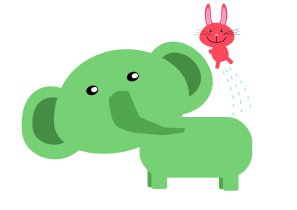

<script>
var c = function() {
    return({
        log: function(msg) {
          consoleDiv = document.getElementById('console');
          para = document.createElement('p');
          text = document.createTextNode(msg);
          para.appendChild(text);
          consoleDiv.appendChild(para);
        }
    });
}();

window.onload = function () {
    var toc = "";
    var level = 0;
    var maxLevel = 3;

    document.getElementById("contents").innerHTML =
        document.getElementById("contents").innerHTML.replace(
            /<h([\d])>([^<]+)<\/h([\d])>/gi,
            function (str, openLevel, titleText, closeLevel) {
                if (openLevel != closeLevel) {
				 c.log(openLevel)
                    return str + ' - ' + openLevel;
                }

                if (openLevel > level) {
                    toc += (new Array(openLevel - level + 1)).join("<ol>");
                } else if (openLevel < level) {
                    toc += (new Array(level - openLevel + 1)).join("</ol>");
                }

                level = parseInt(openLevel);

                var anchor = titleText.replace(/ /g, "_");
                toc += "<li><a href=\"#" + anchor + "\">" + titleText
                    + "</a></li>";

                return "<h" + openLevel + "><a name=\"" + anchor + "\">"
                    + titleText + "</a></h" + closeLevel + ">";
            }
        );

    if (level) {
        toc += (new Array(level + 1)).join("</ol>");
    }

    document.getElementById("toc").innerHTML += toc;
};

</script>
<div id='console'></div>
<div id="contents">

# ไวยากรณ์ภาษาเอสเปรันโต โดยสังเขป
## Konciza Gramatiko de Esperanto
Warut Bunprasert

---

### คำนำ

เอกสารนี้เป็นการนำเสนอไวยากรณ์ระดับพื้นฐานของภาษาเอสเปรันโตเท่านั้นสำหรับผู้ที่กำลังเริ่มเรียนภาษาเอสเปรันโต เอกสารนี้เรียบเรียง จาก Konciza Gramatiko de Esperanto ฉบับภาษาเอสเปรันโต จากเว็บไซต์เรียนภาษาเอสเปรันโต [lernu.net](https://dvd.ikso.net/lernu/lernu/eo/index.html) ในเวอร์ชั่นเก่า หากท่านมีความรู้ในระดับเบื้องต้นแล้วขอแนะนำให้ศึกษาเพิ่มเติมที่่ [PMEG](https://bertilow.com/pmeg/index.html)


วรุฒ บุญประเสริฐ/ 25-09-2559

Markdown/ 16-04-2566

---
# สารบัญ

---

## 1. ตัวอักษร (La alfabeto)
ตัวอักษรภาษาเอสเปรันโตมีทั้งหมด 28 ตัว ดังนี้

```
A B C Ĉ D E F G Ĝ H Ĥ I J Ĵ K L M N O P R S Ŝ T U Ŭ V Z
a b c ĉ d e f g ĝ h ĥ i j ĵ k l m n o p r s ŝ t u ŭ v z
```

การอ่านและการเขียนในภาษาเอสเปรันโตมีกฎเกณฑ์ตายตัว โดยตัวอักษรแต่ละ ตัวจะออกเสียงเหมือนเดิมเสมอ

### สระ (Vokaloj)

| ตัวอักษร  |สัทอักษร   |เสียงใกล้เคียงในภาษาไทย   |หมายเหตุ   |   
|---------|----------|-------------------------|:---------|
| A       | [a]      |  -ะ, -า                 |          |  
| E       | [e]      |  เ-                     |          |  
| I       | [i]      |  -ิ, -ี                   |          |  
| O       | [o]      |  โอ*                    |          |  
| U       | [u]      |  -ุ, -ู                   |          |  

### พยัญชนะ (Konsonantoj)

| ตัวอักษร  |สัทอักษร   |เสียงใกล้เคียงในภาษาไทย   |หมายเหตุ   |   
|---------|----------|-----------------------|:---------|
| B       | [b]      |  บ                    |          |   
| C       | [ts]     |  ทฺซ*                  |          |   
| Ĉ       | [tʃ]     |  ทฺช*                  |          |   
| D       | [d]      |  ด                    |          |   
| F       | [f]      |  ฟ                    |          |   
| G       | [g]      |  ก*                   |เสียงก้อง   |   
| Ĝ       | [dʒ]     |  ดฺจ*                  |หรือ จ     |   
| H       | [h]      |  ฮ                    |          |   
| Ĥ       | [x]      |  ฆ*                   |เสียง ขาก  |   
| J       | [j]      |  ย                    |          |   
| Ĵ       | [ʒ]      |  ฌฺย*                  |          |   
| K       | [k]      |  ก                    |หรือ ค     |   
| L       | [l]      |  ล                    |          |   
| M       | [m]      |  ม                    |          |   
| N       | [n]      |  น                    |          |     
| P       | [p]      |  ป                    |หรือ พ     |   
| R       | [r]      |  ร                    |          |   
| S       | [s]      |  ซ                    |          |   
| Ŝ       | [ʃ]      |  ฌ*                   |          |   
| T       | [t]      |  ต                    |หรือ ต     |   
| Ŭ       | [w]      |  ว                    |          |   
| V       | [v]      |  ฟฺว*                  |          |   
| Z       | [z]      |  ซ*                   |          |   


(*เป็นเสียงที่ไม่มีในภาษาไทยจึงได้เพียงแค่การเทียบเสียงที่ใกล้เคียงเท่านั้น)

### การเน้นเสียง (Akcento)

เน้นเสียงที่สระตัวรองสุดท้ายของในแต่ละคำเสมอ

* v**o**jo /โว้โย่
* kant**a**do /คานต้าโด่/
* **a**pud /อ้าพุด/
* histor**i**o /ฮิสโตรี่ โอ้/
* **a**ŭdi/เอ้าดิ/
* il**i**a/อิลี้อ่า/

### สระประสม (Diftongo)

โดยปกติตัวอักษร ŭ จะปรากฏเฉพาะหลังตัว a e หรือ o เมื่อเชื่อมจะออกเสียงเพียง หนึ่งพยางค์ โปรดสังเกตความแตกต่างกันระหว่างการออกเสียงในสองตัวอย่างต่อไปนี้ **aŭ**to /เอาโต้/- รถเก๋ง, a**u**to /อาอู้โต้/ - (ไม่มีความหมาย)

---

## 2. ชนิดของคำ (Vortklasoj)
คำศัพท์ในภาษาเอสเปรันโตส่วนใหญ่จะลงจบด้วยตัวลงท้ายเพื่อบอกชนิดของคำนั้น ๆ  

|คำนาม -o      |คำคุณศัพท์ -a    | กริยา -i       |กริยาวิเศษณ์ -e  |   
|:-------------:|:------------:|:-------------:|:-------------:|
|dom**o** - บ้าน|grand**a** - ใหญ่ |vid**i** - เห็น|rapid**e** – อย่าง เร็ว |
|knab**o** -เด็กชาย|jun**a** - อ่อนวัย|kur**i** - วิ่ง|buŝ**e** - ในปาก |
|muzik**o** - ดนตรี |ruĝ**a** - สีแดง|est**i** - เป็น, อยู่,คือ|hejm**e** - ในบ้าน|
|skrib**o** - การเขียน|skrib**a** - เกี่ยวกับการเขียน|skrib**i** - เขียน|skrib**e** - โดยการเขียน|

*นอกจากรูปกริยาพื้นฐาน (-i) แล้วยังมีอีกกริยาอีก 5 รูปแบบ โปรดศึกษาเพิ่มเติม ที่ รูปแบบของกริยา

**รูปแบบของกริยาวิเศษณ์บางคำอาจจะไม่ลงท้ายด้วย -e โปรดศึกษาเพิ่มเติมที่ กริยา วิเศษณ์

นอกจากนี้ยังมีคำประเภทหนึ่งที่ไม่มีตัวลงท้าย เราเรียกว่า Vorteto อันได้แก่ บุพบท สันธาน กริยาวิเศษณ์บางคำ และคำตาราง


> Vorteto เป็นคำเป็นไม่มีตัวลงท้ายแสดงชนิดของคำ ส่วนคำที่จะต้องมีตัวลงท้ายแสดงชนิดของคำเราจะเรียกว่า Finaĵvorto ซึ่ง เป็นคำประกอบกันจากรากคำ (Radiko) กับตัวลงท้าย (Finaĵo)

---

## 3. คำนำหน้านามชี้เฉพาะ (Difinita artikolo)

"La" เป็นคำนำหน้านามชี้เฉพาะ ซึ่งจะไม่เปลี่ยนรูปไปตามการก พจน์ หรือเพศ ของ คำนาม

* La hundo - สุนัข (ตัวนั้น)
* La domo - บ้าน (หลังนั้น)
* La knabo - เด็กชาย (คนนั้น)
* La tablo - โต๊ะ (ตัวนั้น)

ในภาษาเอสเปรันโตไม่มีคำนำหน้านามไม่ชี้เฉพาะ ฉะนั้นหากคำนามใด ๆ ไม่มีคำนำหน้า นามชี้เฉพาะวางอยู่ข้างหน้า จะให้ความหมายถึงว่าเป็นสิ่งทั่ว ๆ ไป

* hundo - สุนัข (ทั่วๆไป)
* domo - บ้าน (ทั่วๆไป)

---

## 4. พหูพจน์(Pluralo)
คำพหูพจน์หมายถึงคำที่แสดงจำนวนที่มากกว่า 1 ขึ้นไป  
การสร้างคำพหูพจน์สร้างโดยการเติมตัวลงท้าย -j

* bela hundo - สุนัขรูปร่างดี (หนึ่งตัว)
* belaj hundoj - สุนัขรูปร่างดีหลายตัว
* La knaboj estas junaj - เด็กชายอ่อนวัยหลายคน


* blua kuniklo. กระต่ายสีฟ้า


* bluaj kunikloj. กระต่ายสีฟ้าหลายตัว


* ruĝa kaj blua kunikloj กระต่ายสีแดงและสีฟ้า (หมายถึงกระต่ายมี 2 ตัว โดยที่เป็นสีแดง 1 ตัวและสีฟ้า 1 ตัว)

---

## 5. กรรม (Objekto)
กรรม คือคำที่ถูกกระทำโดยกริยาในประโยค ตัวอย่างเช่น "เด็กเขียนจดหมาย"  จากประโยคดังกล่าวเราจะเห็นได้ว่า เด็ก เป็นประธานของประโยค เขียน เป็นกริยา  และ จดหมาย เป็นกรรมที่ถูกกระทำ
ตัวลงท้าย -n แสดงถึงความเป็นกรรมตรงของประโยค เราจะเติมตัวลงท้าย -n ไว้ท้าย คำ

* La knabo vidas la hundo**n**. - เด็กเห็นสุนัข
* La hundo vidas la knabo**n**. - สุนัขเห็นเด็ก


* La knabo la fiŝo**n** manĝas. เด็กกินปลา


* La knabo**n** la fiŝo manĝas. ปลากินเด็ก


จากตัวอย่างข้างบน เราจะเห็นได้ว่า หากเปลี่ยนตำแหน่งของตัวลงท้าย -n ความหมาย ก็จะเปลี่ยนไปด้วย

หากคำคุณศัพท์เป็นตัวขยายคำนามที่เป็นกรรม ก็จะต้องเติมตัวลงท้าย -n เช่นเดียวกับ คำนามนั้น

* La knabo havas bela**n** hundo**n**. - เด็กมีสุนัขสวย

หากกรรมเป็นพหูพจน์เราจะเติม -n ต่อจากตัวลงท้ายพหูพจน์ -j

* La hundo vidas la belaj**n** katoj**n**. - สุนัขเห็นแมวสวยหลายตัว

---

## 6. การเปรียบเทียบ (Komparado)
ในประโยคแสดงการเปรียบเทียบเราจะใช้ pli - มากกว่า plej - มากที่สุด โดย สามารถใช้ pli - มากกว่า plej - มากที่สุด ได้กับคำคุณศัพท์และคำกริยาวิเศษณ์

* granda - ใหญ่
** **pli** granda - ใหญ่กว่า
* rapide - อย่างเร็ว
** **pli** rapide - อย่างเร็วกว่า
** **plej** rapide - อย่างเร็วที่สุด

คำสันธานของการเปรียบเทียบคือ **ol** (กว่า)

* La tablo estas pli granda **ol** la seĝo. - โต๊ะใหญ่กว่าเก้าอี้


* La elefanto estas pli granda **ol** la kuniklo. ช้างใหญ่กว่ากระต่าย


สำหรับการเปรียบเทียบให้ทางตรงกันข้าม เราจะใช้malpli - น้อยกว่า และ  malplej - น้อยที่สุด

* **malpli** granda - เล็กกว่า
* **malplej** granda - เล็กที่สุด

(สำหรับคำอธิบายเกี่ยวกับคำอุปสรรค 'mal-' กรุณาศึกษาเพิ่มเติมที่ อุปสรรคและปัจจัย)

---

## 7. การแสดงความเป็นเจ้าของ (Posedo)
ในการแสดงความเป็นเจ้าของ เราจะใช้คำบุพบท **de**

* La hundo **de** la knabo. - สุนัขของเด็ก
* La pordoj **de** la domo. - ประตูหลายบานของบ้าน (ประตูบ้านหลายบาน)


* La hundo de la knabo. สุนัขของเด็ก

นอกจากนี้ยังสามารถแสดงความเป็นเจ้าของได้โดยใช้คำสรรพนามแสดงความเป็น เจ้าของและคำตาราง (บางคำ) เช่น

* **mia** hundo - สุนัขของฉัน
* **ies** hundo - สุนัขของคนบางคน

---

## 8. คำสรรพนาม (Pronomoj)
บุรุษสรรพนาม สรรพนามแสดงความเป็นเจ้าของ

* mi ฉัน, ผม, ดิฉัน mia ของฉัน
* vi คุณ, ท่าน via ของคุณ
* ŝi เขา (ผู้หญิง) ŝia ของเขา (ผู้หญิง)
* li เขา (ผู้ชาย) lia ของเขา (ผู้ชาย)
* ĝi มัน ĝia ของมัน
* ni พวกเรา nia ของพวกเรา
* ili พวกเขา ilia ของพวกเขา

oni บุรุษสรรพนามไม่เจาะจง onia บุรุษสรรพนามไม่เจาะจง si เขาเอง sia ของเขาเอง

เมื่อคำบุรุษสรรพนามเป็นกรรมในประโยค จะต้องลงท้ายด้วย -n

* Mi amas vi**n**. - ฉันรักคุณ
* Ili vidas ĝi**n**. - พวกเขาเห็นมัน

คำสรรพนามแสดงความเป็นเจ้าของที่เป็นกรรมในประโยคและขยายคำนามที่เป็น พหูพจน์ คำสรรพนามแสดงความเป็นเจ้านั้นของก็จะต้องลงท้ายด้วยตัวลงท้ายพหูพจน์  -j และต่อด้วยตัวลงท้ายของกรรม -n

* Ŝi amas mia**n** frato**n**. - เธอรักน้องชายของฉัน
* Mi vidas viaj**n** domoj**n**. - ฉันเห็นบ้านหลายหลังของคุณ


### Si

Si เป็นบุรุษสรรพนามสะท้อนบุรุษที่ 3 ทำหน้าที่แสดงการกระทำต่อตัวเอง โดยจะใช้ กับ ŝi, li, ĝi, ili, oni (สรรพนามบุรุษที่ 3 เอกพจน์และพหูพจน์ และบุรุษสรรพ นามไม่เจาะจง) หรือคำอื่น ๆ ที่ใช้แทนคำบุรุษสรรพนามเหล่านั้น
โปรดสังเกตไว้ว่าเราจะไม่ใช้ si กับ mi, vi หรือ ni เพื่อแสดงการกระทำต่อตนเอง

* Mi pensas pri mi. - ฉันคิดเกี่ยวกับฉัน
* Vi pensas pri vi. - คุณคิดเกี่ยวกับคุณ
* Li pensas pri li. - เขาคิดเกี่ยวกับเขา (เขาคิดเกี่ยวกับเขาอีกคนหนึ่ง)
* Li pensas pri si. - เขาคิดเกี่ยวกับเขาเอง

### Oni

Oni เป็นบุรุษสรรพนามที่ไม่ได้ชี้เฉพาะเจาะจง ใช้กล่าวถึงใครก็ได้ โดยมีความหมายถึง บุคคลในลักษณะกว้าง ๆ

Oni สามารถเป็นได้ทั้งเอกพจน์และพหูพจน์ (อาจจะแปลใน ภาษาไทยได้ว่า เขา พวกเขา เรา พวกเรา คนเรา ใคร ๆ )  

* Oni pensas pri si mem. – พวกเขาคิดเกี่ยวกับพวกเขาเอง

---

## 9. รูปแบบของกริยา (Verbformoj)

| ตัวลงท้าย    | คำอธิบาย     |ตัวอย่าง|
| ------------- |------------- |------------- |
| **-i**       | รูปแบบพื้นฐาน       |est**i** - เป็น, skrib**i** - เขียน|
| **-as**       |เวลาปัจจุบัน       |est**as** - กำลังเป็น, skrib**as** - กำลังเขียน|
| **-is**      | เวลาที่ผ่านไปแล้ว        |est**is** - เป็นไปแล้ว, skrib**is** - เขียนไปแล้ว|
| **-os**      |เวลาที่กำลังมาถึง        |est**os** - จะเป็น, skrib**os** - จะเขียน|
|**-us**      | รูปแบบสมมติ       |est**us** - เป็น (สมมติ), skrib**us** - เขียน (สมมติ)|
| **-u**       |รูปแบบขอร้องหรือคำสั่ง      |est**u** silenta - โปรดเงียบ, skrib**u** - โปรดเขียน|

### รูปแบบของกริยาที่มากกว่า 1 (Kompleksaj verbkonstruoj)

รูปแบบของกริยาที่มากกกว่า 1 เป็นรูปแบบที่ประกอบจากกริยาหลักและกริยารอง โดย กริยาหลักจะอยู่ในรูปของกริยาที่ผันไปตามกาลหรือตามมาลา ส่วนกริยารองจะอยู่ใน รูปแบบของกริยาพื้นฐาน โดยส่วนใหญ่แล้วรูปแบบของกริยาที่มากกว่า 1 นี้ มักจะใช้ กริยา povi, devi, voli เป็นกริยาหลัก

ตัวอย่างเช่น

* Mi vol**as** manĝ**i**. - ฉันต้องการกิน (ปัจจุบัน)
* Mi ne pov**is** ven**i**. - ฉันไม่สามารมาได้แล้ว (อดีต)
* Mi dev**os** labor**i**. - ฉันจะต้องทำงาน (อนาคต)

---

## 10. กริยาวิเศษณ์ (Adverboj)

กริยาวิเศษณ์เป็นคำที่ขยาย กริยา คุณศัพท์ กริยาวิเศษณ์ หรือประโยคทั้งประโยค แสดง ถึงวิธีการ สถานที่ เวลา หรือ จำนวน  
กริยาวิเศษณ์ในภาษาเอสเปรันโตจะลงท้ายด้วย -e

| คำศัพท์    | แปลงเป็นกริยาวิเศษณ์     |
| :------------- | :------------- |
|rapid**a** - เร็ว     |rapid**e** - อย่างเร็ว (กริยาวิเศษณ์แสดงวิธีการ)   |
|skrib**i** - เขียน     |skrib**e** - ด้วยวิธีการเขียน (กริยาวิเศษณ์แสดงวิธีการ)      |
|hejm**o** - บ้าน    |hejm**e** - ในบ้าน (กริยาวิเศษณ์แสดงสถานที่)      |
|nokt**o** - กลางคืน      |nokt**e** - ในเวลากลางคืน (กริยาวิเศษณ์แสดงเวลา)      |
|mult**a**j - มาก       |mult**e** - อย่างมาก (กริยาวิเศษณ์แสดงจำนวน)      |

นอกจากนี้ยังกริยาวิเศษณ์ที่เป็นจำพวก vorteto และคำที่ลงท้ายด้วย -aŭ
```
ankoraŭ - ยังคง
almenaŭ - อย่างน้อย
apenaŭ - แทบจะไม่
baldaŭ - ในไม่ช้า
preskaŭ - เกือบจะ
eĉ - อีก
morgaŭ - พรุ่งนี้
hodiaŭ - วันนี้
hieraŭ - เมื่อวาน
jam - แล้ว
jen - นี่
ĵus - เพิ่งจะ
nun - ตอนนี้
nur - เท่านั้น
plu - เพิ่ม
tre - มาก
tro - มากเกินไป
tuj - เดี๋ยวนี้
for - ไกล
```

---

## 11. คำบุพบท (Prepozicioj)

|คำบุพบท|ความหมาย|ตัวอย่าง|
|---|---|---|
|al 	|ไปยัง, ถึง 	|Mi iras al vi. - ฉันกำลังไปยังคุณ La kuniklo kuras al la barelo. กระต่ายกำลังวิ่งไปยังถังไม้|
|anstataŭ| 	แทน| 	Mi iras anstataŭ vi. - ฉันกำลังไปแทนคุณ|
|antaŭ| 	ด้านหน้า,  ข้างหน้า|	Mi iras antaŭ vi. - ฉันกำลังไปด้านหน้าคุณ  La kuniklo sidas antaŭ la barelo. กระต่ายกำลังนั่งอยู่หน้าถังไม้|
|apud| 	ข้างๆ| 	Mi iras apud vi. - ฉันกำลังไปข้าง ๆ คุณ  La kuniklo sidas apud la barelo. กระต่ายกำลังนั่งอยู่ข้าง ๆ ถังไม้|
|ĉe| 	ที่ |	Mi sidas ĉe komputilo. - ฉันกำลังนั่งอยู่ที่ คอมพิวเตอร์  La kuniklo sidas ĉe la barelo. กระต่ายกำลังนั่งที่ถังไม้|
|ĉirkaŭ| 	รอบๆ|	Mi iras ĉirkaŭ vi. – ฉันกำลังวิ่งอยู่รอบ ๆ คุณ  La kuniklo kuras ĉirkaŭ la barelo. กระต่ายกำลังวิ่งรอบถังไม้|
|da |	ของ (แสดงจำนวนหรือ ปริมาณ)|	Ni havis multe da gastoj. – พวกเรามีแขกมาก|
|de |	จาก, ของ |	Mi iras de la domo. - ฉันกำลังไปจากบ้าน|
|dum |	ระหว่าง (เวลา)|	Ni iris dum tri minutoj. - พวกเราไปใน เวลาสามนาที|
|ekster 	|ด้านนอก,  ข้างนอก|	Mi iras ekster la domo. – ฉันกำลังไป ข้างนอกบ้าน La kuniklo staras ekster la barelo. กระต่ายกำลังยืนอยู่นอกถังไม้|
|el 	|จาก 	|Mi iras el la domo. - ฉันกำลังไปจากบ้าน  La kuniklo saltas el la barelo. กระต่ายกำลังกระโดดออกจากถังไม้|
|en 	|ใน |	Mi iras en la domo. - ฉันกำลังไปในบ้าน  La kuniklo estas en la barelo. กระต่ายอยู่ในถังไม้|
|ĝis 	|จนกระทั่ง,  จนกระทั่งถึง , จนถึง|	Mi iras ĝis la domo. - ฉันกำลังไปจนถึงบ้าน|
|inter 	|ระหว่าง |	Mi iras inter la domoj. - ฉันกำลังไป ระหว่างบ้านหลายหลัง  La kuniklo sidas inter la bareloj. กระต่ายกำลังนั่งอยู่ระหว่างถังไม้|
|je 	|ต่อ, ใน |	Li kredas je Dio. - เขาเชื่อต่อพระเจ้า|
|kontraŭ 	|ตรงข้าม |	Mi iras kontraŭ via volo. - ฉันไปตรงกัน ข้ามกับทางของคุณ|
|krom 	|ยกเว้น, นอกจาก|	Ĉiuj krom mi iris. - ทุกคนไปยกเว้นฉัน|
|kun 	|กับ |	Mi iras kun vi. - ฉันไปกับคุณ  La kuniklo iras kun la barelo. กระต่ายวิ่งไปพร้อมกับถังไม้|
|laŭ 	|ตาม |	Mi iras laŭ la vojo. - ฉันไปตามทาง|
|malgraŭ 	|ถึงแม้ว่า |	Mi iras malgraŭ la pluvo. - ฉันไป ถึงแม้ว่าจะมีฝน|
|per 	|โดย  (เครื่องมือ)|	Mi vojaĝas per trajno. - ฉันเดินทางโดน รถไฟ|
|por 	|เพื่อ |	Mi eniras por manĝi. - ฉันเข้ามาเพื่อกิน|
|po 	|แต่ละ, ต่อ  (จำนวน)|	Po du eŭroj por persono. - สองยูโร สำหรับหนึ่งคน|
|post 	|ด้านหลัง, ข้างหลัง	|Mi iras post vi. - ฉันไปข้างหลังคุณ  La kuniklo kuras post la barelo. กระต่ายกำลังวิ่งอยู่หลังถังไม้|
|preter 	|ผ่าน| 	Mi iras preter vi. – ฉันกำลังไปผ่านคุณ (ฉัน กำลังผ่านคุณไป) La kuniklo kuras preter la barelo. กระต่ายกำลังวิ่งผ่านถังไม้|
|pri 	|เกี่ยวกับ |	Mi pensas pri vi. - ฉันคิดเกี่ยวกับคุณ  La kuniklo parolas pri la barelo. กระต่ายกำลังพูดเกี่ยวกับถังไม้|
|pro 	|เนื่องจาก |	Mi eniras pro la pluvo. - ฉันเข้ามา เนื่องจากฝนตก|
|sen 	|ปราศจาก,  ไม่มี|	Mi iras sen vi. - ฉันไปโดยที่ไม่มีคุณ  La kuniklo iras sen la barelo. กระต่ายกำลังวิ่งโดยที่ไม่มีถังไม้|
|sub 	|ข้างใต้ |	Mi iras sub la domo. - ฉันกำลังไปข้างใต้ บ้าน  La kuniklo kuŝas sub la elefanto. กระต่ายกำลังนอนอยู่ใต้ช้าง|
|super 	|เหนือ |	Mi estas super vi. - ฉันอยู่เหนือคุณ|
|sur 	|บน |	Mi estas sur la domo. – ฉันอยู่บนบ้าน  La kuniklo staras sur la porko. กระต่ายกำลังยืนอยู่บนหมู|
|tra 	|ผ่าน, ทะลุ,  ตลอด|	Mi iras tra la domo. - ฉันไปผ่านทะลุบ้าน  La kuniklo rampas tra la barelo. กระต่ายกำลังเลื้อยผ่านถังไม้|
|trans |ข้าม |	Mi iras trans la straton. - ฉันกำลังข้าม ถนน |

### การใช้ De

De สามารถใช้ในหลายบริบท ตัวอย่างเช่น การเคลื่อนที่ ที่มา เหตุที่ทำให้เกิด เวลา  หรือลักษณะ

* Mi venas **de** la urbo. - ฉันมาจากเมือง
* Mi ricevis kison **de** vi. - ฉันได้รับการจูบจากเธอ
* Mi ridas **de** ĝojo. - ฉันหัวเราะเนื่องจากความสุข
* **De** nun mi amas vin. - ผมรักคุณตั้งแต่ตอนนี้
* Glaso **de** biero. - แก้วเบียร์

### การใช้ Da

Da ใช้เพื่อแสดงจำนวนหรือปริมาตร โดยสังเกตได้จากคำที่อญุ่ข้างหน้า da จะเป็นคำ ที่มีความหมายถึงจำนวนหรือปริมาณ  

* 1 kilogramo **da** rizo - ข้าวหนึ่งกิโลกรัม
* du litroj **da** lakto - นมสองลิตร
* glaso **da** biero - เบียร์หนึ่งแก้ว
* glaso **de** biero - แก้วเบียร์ (≈แก้วของเบียร์)  



multe da bananoj
กล้วยจำนวนมาก

### การใช้ Je

เราจะใช้บุพบท je กับสิ่งที่เป็นนามธรรม

* Li kredas **je** Dio. - เขาเชื่อต่อพระเจ้า

และโดยปกติ je จะใช้แสดงเกี่ยวกับเวลา

* **Je** la tria horo - ณ เวลาสามนาฬิกา

### ตัวลงท้าย -n แทนคำบุพบท

เราสามารถแทนคำบุพบทโดยใช้ตัวลงท้าย -n สำหรับการใช้แสดงเกี่ยวกับเวลา หรือปริมาณ

* **En** la 22-a de junio mi venos. - La 22-a**n** de junio mi  venos. (ฉันจะมาในวันที่ 22 เดือนมิถุนายน)

* Mi estas **je** 20-metra distanco de vi - Mi estas 20  metroj**n** for de vi. (ฉันสูงกว่าคุณ 20 เมตร)

---

## 12.สันธาน (Konjunkcioj)
คำสันธาน คือ คำเชื่อมคำที่อยู่ในสถานะเดียวกัน เชื่อมวลี หรือ เชื่อมประโยค

### kaj – และ
* Karlo kaj Petro manĝas. คาร์ลและปีเตอร์กำลังกินอยู่
* Karlo manĝas kaj trinkas. คาร์ลกำลังกินและดื่ม
* Karlo manĝas rizon kaj legomojn. คาร์ลกำลังกินข้าวและผัก

### aŭ – หรือ
* Petro aŭ Karlo laboras. ปีเตอร์หรือคาร์ลทำงาน
* Ni povas manĝi viandaĵon aŭ fiŝaĵon. Kion vi preferas?  พวกเราสามารถรับประทานได้ทั้งเนื้อสัตว์และเนื้อปลา, คุณชอบอะไร

### sed – แต่
* La papero estas tre blanka, sed la neĝo estas pli  blanka. กระดาษนั้นขาวมาก แต่หิมะขาวมากกว่า
* Li amas min, sed mi lin ne amas. เขารักฉัน แต่ฉันไม่ได้รักเขา  *(= sed mi ne amas lin)*

## 13.การแสดงทิศทางโดย –n (Direkto per –n)
โดยปกติคำหลังคำบุพทบเราจะใช้รูปแบบที่ไม่ลงท้ายด้วย -n

* pri la knabo - เกี่ยวกับเด็ก
* en la domoj - ในบ้านหลายหลัง
* al la urbo - ไปยังเมือง

แต่เราสามารถใช้ตัวลงท้าย -n เมื่อต้องการแสดงการเคลื่อนที่เข้าไปยังสถานที่นั้น

* Hundo saltas sur la tablo. - สุนัขกระโดดอยู่บนโต๊ะ
* Hundo saltas sur la tablo**n**. - สุนัขกระโดดไปยังโต๊ะ
* Mi iras en la domo. - ฉันไป(เคลื่อนที่ไปมา)อยู่ในบ้าน
* Mi iras en la domo**n**. – ฉันเข้าไปในบ้าน


* La kuniklo saltas sur la elefanto**n**. กระต่ายกระโดดไปบนช้าง



* La kuniklo saltas sur la elefanto. กระต่ายกระโดดอยู่บนช้าง


และเช่นเดียวกันกับคำกริยาวิเศษณ์ที่บ่งชี้ถึงสถานที่

* hejme - ในบ้าน | hejme**n** - ไปยังในบ้าน
* urbe - ในเมือง | urbe**n** - ไปยังในเมือง
* kie - ที่ไหน, ในที่ไหน | kie**n** - ไปยังที่ไหน
* tie - ที่นั้น, ในที่นั้น | tie**n** - ไปยังที่นั้น

---

## 14.ตัวเลข (Numeralo)

ตัวเลขพื้นฐาน
```
0 - nul
1 - unu
2 - du
3 - tri
4 - kvar
5 - kvin
6 - ses
7 - sep
8 - ok
9 - naŭ
10 - dek

100 - cent
1000 - mil
```

ตัวเลขจำนวนอื่น ๆ สร้างจากการนำตัวเลขพื้นฐานมาผสมกัน

```
11 - dek unu
12 - dek du
20 - dudek
25 - dudek kvin
237 - ducent tridek sep
1983 - mil naŭcent okdek tri
2002 - du mil du
```
เลขจำนวนหลักสิบและหลักร้อยจะเขียนติดกันเป็นหนึ่งคำ
```
dudek, tridek, ducent, tricent
```
ส่วนตัวเลขจำนวนอื่น ๆ จะเขียนแยกออกจากันเป็นคำ ๆ รวมไปถึงเลขจำนวนพัน
```
dek unu, dek du, du mil
```
ตัวเลขพื้นฐานจะไม่ผัน

* Mi vidas tri domojn. - ฉันเห็นบ้านสามหลัง

ตัวเลขสำหรับแสดงลำดับที่ จะลงท้ายด้วย -a (ทำให้เป็นคำคุณศัพท์)

```
unua - ที่หนึ่ง
dua - ที่สอง
deka - ที่สิบ
okdek naŭa / okdek-naŭa - แปดสิบเก้า
```
(สามารถใช้ขีดหรือไม่ใช้ขีดขั้น ระหว่างคำก็ได้)

* Mi skribas la unuan leteron. - ฉันเขียนจดหมายฉบับแรก (ฉบับที่หนึ่ง)

---

## 15.ประโยคคำถาม (Demando)
คำสำหรับการตั้งคำถามนั้นจะใช้คำจากคำตารางในกลุ่ม KI- และจะวางไว้หน้าประโยคเสมอ

* Kio estas tio? - นั้นคืออะไร
* Kiel vi fartas? - คุณเป็นอย่างไรบ้าง
* Kiam vi venos? - คุณจะมาเมื่อไหร่

### Ĉu
สำหรับประโยคคำถามที่ตอบว่า "ใช่" หรือ "ไม่ใช่" เราจะใช้คำขึ้นต้นคำถาม ĉu

* Ŝi estas knabino. - เธอคือเด็กหญิง
** Ĉu ŝi estas knabino? - เธอ คือเด็กหญิงใช่หรือไหม

* Ĉu la knabino estas juna? - เด็กหญิง(คนนั้น)ยังเป็นวัยรุ่นอยู่ใช่ไหม  
** Jes, ŝi estas juna. - ใช่, เธอยังเป็นวัยรุ่นอยู่

---

## 16. การปฏิเสธ (Negacio)
### Ne - ไม่
* Mi ne estas juna. - ฉันไม่ใช่วัยรุ่น
* Ne, mi ne volas. - ไม่, ฉันไม่ต้องการ


* La hundo ne volas iri. สุนัขไม่อยากไป

เราจะวาง ne ไว้ข้างหน้าคำที่ต้องการแสดงการปฏิเสธ โดยปกติเราจะวางไว้หน้ากริยา  แต่ก็สามารถวางไว้หน้าคำชนิดอื่น ๆ ได้เช่นกัน

* Mi manĝas ne pomon, sed piron. - ฉันไม่กินแอปเปิ้ลแต่กินลูกแพร์

สำหรับการปฏิเสธ เราสามารถใช้คำเทียบเคียง ในกลุ่ม NENI

* Mi komprenas nenion. - ฉันไม่เข้าใจอะไรเลย
* Mi neniam estis tie. - ฉันไม่เคยอยู่ที่นี่

กลุ่มคำ NENI- โดยปกติจะทำให้ประโยคปฏิเสธอยู่แล้ว แต่ถ้าในประโยคมีคำปฏิเสธ สองคำก็จะทำให้ความหมายในประโยคเปลี่ยนไปอย่างตรงกันข้าม

* Mi ne faras nenion. - ฉันทำไม่ไม่ทำอะไรสักอย่าง ≈ ฉันทำทุกอย่าง Mi ne povas ne veni. - ฉันไม่สามารถไม่มา ≈ ฉันสามารถมาได้

หลังจากคำปฏิเสธ เราจะใช้คำสันธาน nek ซึ่งมีความว่า ankaŭ ne (และก็ไม่ ด้วย) เพื่อเป็นการแสดงการปฏิเสธเพิ่มเติม

* Mi ne vidis lin, nek lian patron. - ฉันไม่เห็นเขาและก็พ่อของเขาด้วย
* Neniu leciono nek prelego plaĉis al ŝi.- ไม่มีบทเรียนและการ บรรยายไหนเลยที่เธอพอใจ

ส่วน nek สองครั้ง จะให้ความหมายว่า kaj ne (และก็ไม่)

* Mi vidis nek lin, nek lian patron. - ฉันไม่เห็นเขาและก็ไม่เห็นพ่อของ เขาด้วย
* Mi ŝatas nek drinki nek fumi. - ฉันไม่ชอบดื่มและก็ไม่ชอบสูบบุหรี่

---

## 17.Participo  
Participo คือคำที่แสดงลักษณะ (กำลังจะดำเนิน, กำลังดำเนินอยู่, ดำเนินไปแล้ว) และสถานะการกระทำของกริยาว่ากระทำต่อบางอย่างหรือถูกกระทำโดยบางอย่าง  แต่ไม่ได้บ่งชี้ว่าเกิดขึ้นในกาลใด เช่น skribanta (ซึ่งกำลังเขียน), batita (ซึ่งถูกตี ไปแล้ว), fermita (ซึ่งถูกปิดไปแล้ว) ในภาษาเอสเปรันโตจะมี Participo อยู่ 6  รูปแบบ

| Participo แสดงการกระทำ     | Participo แสดงการถูกการกระทำ    | ความหมาย|
| :-------------: | :-------------: |-----|
| -ant-        | -at-       |กำลังดำเนินอยู่|
| -int-        | -it-       |ดำเนินไปแล้ว|
| -ont-        | -ot-       |กำลังจะดำเนิน|

### Participo แสดงการกระทำ
Participo แสดงการกระทำ (Aktiva participo) แสดงถึงลักษณะการ ดำเนินการกระทำของกริยา

* skribanta - ซึ่งกำลังเขียน
* skribinta - ซึ่งเขียนไปแล้ว (เขียนเสร็จแล้ว)
* skribonta - ซึ่งจะเขียน

การลงท้ายด้วย -a เป็นการแสดงให้เห็นว่าเป็นคำที่สามารถขยายลักษณะของคำนามได้

* skribanta knabo - เด็กชายที่กำลังเขียน(บางอย่าง)
* skribinta knabo - เด็กชายที่เขียน(บางอย่าง)ไปแล้ว

สามารถแสดงกาลได้โดยใช้กริยา esti  

* Mi estis skribanta. - ฉันกำลังเขียน (เกิดในอดีต-โดยสังเกตจากกริยา  estis)
* Ili estos skribantaj. - พวกเขากำลังเขียน (เกิดในอนาคต-โดยสังเกตจากกริยา  estos)
* Ŝi estis skribonta. - เธอจะเขียน (เกิดในอดีต-โดยสังเกตจากกริยา estis)

เราสามารถสร้างคำที่แสดงถึงบุคคลแสดงการกระทำบางอย่างได้โดยตัวใช้ลงท้าย -o

* skribanto - ผู้ที่กำลังเขียน
* skribinto - ผู้ที่เขียนไปแล้ว
* skribonto - ผู้ที่จะเขียน

Participo สามารถใช้ในรูปกริยาวิเศษณ์ได้  

* Skribante li pensis pri ŝi. - ในขณะที่กำลังเขียน เขาคิดเกี่ยวกับเธอ

## Participo แสดงการถูกกระทำ
Participo แสดงการถูกกระทำ (Pasiva participo) จะแสดงถึงลักษณะการ ดำเนินการถูกกระทำของกริยา

* skribata - กำลังถูกเขียน
* skribita - ถูกเขียนไปแล้ว
* skribota - จะถูกเขียน

การลงท้ายด้วย -a เป็นการแสดงให้เห็นว่าเป็นคำที่สามารถขยายลักษณะของคำนามได้

* skribata letero - จดหมายที่กำลังถูกเขียน
* skribita letero - จดหมายที่ถูกเขียนไปแล้ว

สามารถแสดงกาลได้โดยการใช้กริยา esti

* La letero estas skribata de mi. - จดหมายกำลังถูกเขียนโดยฉัน  (เกิดในปัจจุบัน-สังเกตจากกริยา estas)
* La letero estis skribata de ŝi. - จดหมายกำลังถูกเขียนโดยเธอ  (เกิดในอดีต-สังเกตจากกริยา estis)
* La letero estis skribita de li. - จดหมายถูกเขียนไปแล้ว  (เกิดในอดีต-สังเกตจากกริยา estis)

---

## 18. คำตาราง [^1] (Tabelvortoj)
คำตาราง คือ คำจำพวก "คำถาม" และ "คำตอบ" ที่ถูกสร้างอย่างเป็นระบบ ซึ่งประกอบ ขึ้นจากส่วนของพยางค์หน้าและพยางค์หลัง นำมาผสมกันเป็นคำต่าง ๆ

| พยางค์หน้า    | ความหมาย   |   
| :----------- | :--------- |
| ki-          | คำถาม      |
| ti-          | ชี้เฉพาะ     |
| i-           | บางอย่าง    |
| ĉi-          | ทั้งหมด, แต่ละ    |
| neni-        | ไม่มี, ปราศจาก   |

| พยางค์หลัง    | ความหมาย   |   
| :----------- | :--------- |
| -o          | สิ่งที่ไม่ได้ชี้เฉพาะ      |
| -u          | สิ่งที่ชี้เฉพาะ, บุคคล    |
| -a          | ลักษณะ      |
| -el          | วิธีการ     |
| -e           | สถานที่     |
| -am          | เวลา      |
| -om          | จำนวน     |
| -al         | เหตุผล      |
| -es         | แสดงความเป็นเจ้าของ   |

คำที่เกิดจากการผสมระหว่างพยางค์หน้าและพยางค์หลัง เราสามารถดูได้จากตาราง ดังต่อไปนี้

|      | Header Two     ||||
| :------------- | :------------- |:------------- |:------------- |:------------- |
| Item One       | Item Two       |Item Two       |Item Two       |Item Two       |


### Ĉi
คำ ĉi แสดงถึงความใกล้ ซึ่งจะใช้กับคำที่ขึ้นต้นด้วย ti- โดยที่ ĉi- สามารถวางไว้ ข้างหน้าหรือข้างหลังก็ได้

* tie ĉi / ĉi tie - ที่นี่
* tiu ĉi / ĉi tiu - สิ่งนี้, คนนี้
* ĉio ĉi / ĉi ĉio - ทุกสิ่งที่ใกล้ๆ

### Ajn

คำ ajn มีความหมายว่า "อย่างไรก็ได้"

* kiam ajn - เมื่อใดก็ได้
* kiu ajn - ใครก็ได้, สิ่งไหนก็ได้

### คำสรรพนามเชื่อมความ

คำกลุ่ม KI- จะใช้เป็นคำเชื่อมความ คือแทนคำที่อยู่ข้างหน้า

* Tio, kion li diris, estas bona. - สิ่งนั้น, ซึ่งเป็นสิ่งที่ คุณพูด, เป็นสิ่งที่ดี
* La knabino, kiu staras tie. - เด็กหญิง (คนนั้น), ซึ่งเป็นผู้ที่ยืนอยู่ที่นั้น
* Ĝi estas granda kiel domo. - มันใหญ่เหมือนดังบ้าน

---

## 19. การสร้างคำ (Vortfarado)
รากคำหนึ่งคำในภาษาเอสเปรันโตสามารถเปลี่ยนชนิดของคำได้ จากการเติมตัวลงท้ายและ สามารถสร้างคำศัพท์ใหม่ได้โดยง่ายจากการนำคำมาผสม ซึ่งเป็นข้อดีของผู้เรียนภาษา เอสเปรันโตที่ไม่จำเป็นที่จะต้องจำคำศัพท์มากมายดังเช่นภาษาอื่น ๆ
รากคำหนึ่งคำนั้นสามารถใช้ตัวลงท้ายได้หลากหลาย

เมื่อเราสร้างคำผสม เราสามารถใช้หรือละตัวลงท้ายที่แสดงชนิดของคำในคำแรกได้ ทั้งนี้ ขึ้นอยู่กับความสะดวกในการออกเสียง

* skrib' + tabl' => skribotablo / skribtablo - โต๊ะเขียนหนังสือ

---

## 20. อุปสรรคและปัจจัย (Prefiksoj kaj Sufiksoj)
อุปสรรคและปัจจัยในภาษาเอสเปรันโตเป็นส่วนที่สำคัญมากในการสร้างคำ โดยในภาษา เอสเปรันโตจะมีอุปสรรค 10 คำ และมีปัจจัย 31 คำ

### อุปสรรค (Prefiksoj)

|คำอุปสรรค     |ความหมาย     |คำศัพท์|เติมคำอุปสรรค|
| :------------- | :------------- |---|---|
|bo- |แสดงความสัมพันธ์จากการแต่งงาน |patro - พ่อ |**bo**patro - พ่อตา |
|dis- |ทิศทางที่กระจาย |doni - ให้ |**dis**doni - แจก |
|ek- |การเริ่ม |vidi - เห็น| **ek**vidi - เริ่มเห็น |
|eks-| แสดงความเป็นอดีต| reĝo - พระราชา |**eks**reĝo - อดีตพระราชา |
|fi- |มีลักษณะที่ไม่ดี |domo - บ้าน |**fi**domo - บ้านเก่าที่จะพัง|
|ge-| สองเพศ |patro - พ่อ| **ge**patroj - พ่อแม่ |
|mal- |ตรงข้าม| bona - ดี| **mal**bona - ชั่ว|
|mis- |ไม่ถูก, ผิด| uzi - ใช้ |**mis**uzi - ใช้ผิด|
|pra- |เวลาในอดีต, เวลาที่ล่วงมานานแล้ว| tempo - เวลา |**pra**tempo - ดึกดำบรรพ์ |
|re- |อีกครั้ง| veni - มา| **re**veni - มาอีกครั้ง (กลับ)|

### ปัจจัย (Sufiksoj)

|คำปัจจัย     |ความหมาย     |คำศัพท์|เติมคำปัจจัย|
| :------------- | :------------- |---|---|
|-aĉ- |ไม่ดี (บ่งชี้คุณภาพ)| domo - บ้าน |dom**aĉ**o -บ้านไม่ดี, บ้านที่ก่อสร้าง ไม่ดี |
|-ad-| การกระทำที่ต่อเนื่อง |kanti - ร้องเพลง| kant**ad**o - การร้องเพลง |
|-aĵ-| สิ่งของ (ความเป็นรูปธรรม) |alta - สูง| alt**aĵ**o - สิ่งที่สูง |
|-an-| สมาชิก |Kristo - พระเยซู| krist**an**o - ชาวคริสต์ |
|-ar- |กลุ่มที่มีจำนวนมาก| arbo - ต้นไม้ |arb**ar**o - ป่า|
|-ĉj-  |เป็นการสร้างชื่อเล่นของเพศ ชาย (โดยใช้หลังชื่อจริง 2-5  ตัวอักษร)| patro - พ่อ| pa**ĉj**o - พ่อ (ชื่อเล่น) |
|-ebl- |สามารถ, เป็นไปได้| legi - อ่าน| leg**ebl**a - สามารถอ่านได้ |
|-ec- |ความเป็นนามธรรม|rapida - เร็ว |rapid**ec**o - ความเร็ว |
|-eg- |ใหญ่, มาก| varma - ร้อน| varm**eg**a - ร้อนมาก |
|-ej- |สถานที่| kuiri - ทำอาหาร| kuir**ej**o - ครัว |
|-em- |แนวโน้ม, ความชอบ| dormi - นอน| dorm**em**a - ง่วง |
|-end- |ต้องทำ| legi - อ่าน| leg**end**a - ต้องอ่าน |
|-er- |แสดงถึงความเป็นชิ้นเป็นอัน| sablo - ทราย| sabl**er**o - เม็ดทราย |
|-estr-| ผู้นำ| lernejo - โรงเรียน| lernej**estr**o - ครูใหญ่ |
|-et- |เล็ก, น้อย| varma - ร้อน| varm**et**a - อุ่น |
|-id- |ลูก| hundo - สุนัข| hund**id**o - ลูกสุนัข |
|-ig-| ทำให้| labori - ทำงาน| labor**ig**i - ทำให้(บางอย่าง)ทำงาน |
|-iĝ-| กลายเป็น, การรับสถานะใหม่| ruĝa - สีแดง| ruĝ**iĝ**i - กลายเป็นสีแดง |
|-il-| เครื่องมือ| tranĉi - ตัด| tranĉ**il**o - มีด |
|-in-| แสดงถึงเพศหญิง| knabo - เด็กชาย| knab**in**o - เด็กหญิง |
|-ind-| น่า, มีคุณค่า| legi - อ่าน |leg**ind**a - น่าอ่าน |
|-ing-| ที่จับ, มือจับ| glavo - ดาบ| glav**ing**o - ด้ามจับของดาบ |
|-ism-| ระบบความคิด, ระบบ|kristano - ชาวคริสต์ |kristan**ism**o - ศาสนาคริสต์ |
|-ist-| อาชีพ, การงานหรือระบบ ความคิดที่ต่อเนื่อง| labori - ทำงาน |labor**ist**o - ผนักงาน |
|-nj-| เป็นการสร้างชื่อเล่นของเพศ หญิง (โดยใช้หลังชื่อจริง 2-5  ตัวอักษร)|  patrino| - แม่ pa**nj**o - แม่ (ชื่อเล่น) |
|-obl-| การทวีคูณ, ครั้ง| du - สอง| du**obl**o - คูณสอง, สองเท่า|
|-on-| การแบ่งส่วน| du - สอง| du**on**o - ส่วนสอง (ครึ่ง) |
|-op-| แสดงความเป็นกลุ่ม| du - สอง| du**op**e - กลุ่มสอง(คน,สิ่ง) |
|-uj-| ภาชนะ, สิ่งที่สำหรับใส่ บางอย่าง| mono - เงิน| mon**uj**o - กระเป๋าสตางค์ |
|-ul-| บุคคล| juna - วัยรุ่น |jun**ul**o - คนวัยรุ่น|
|-um-| ปัจจัยพิเศษ ความหมายเฉพาะ| komuna - สิ่งกลาง| komun**um**o - ชุมชน, สังคม|

เราสามารถใช้อุปสรรคและปัจจัยได้พร้อมกัน

* patro - พ่อ > ***bo***__ge__patroj –พ่อตาและแม่ยาย
* labori - ทำงาน > ***mal***labor**em**a - ขี้เกียจ

อุปสรรคและปัจจัยนั้นสามารถสร้างเป็นคำชนิดต่าง ๆ ได้ด้วยตัวเอง  โดยการเติมตัวลงท้ายเพื่อแสดงชนิดของคำที่ต้องการ

* **il**o - เครื่องมือ, อุปกรณ์ (คำนาม)
* **ek**as - กำลังเริ่ม (คำกริยา)

---

[^1]: ใน Plena Manlibro de Esperanta Gramatiko (= PMEG) (2016) กลุ่มคำเหล่านี้เรียนว่า Tabelvorto แปลตรงตัวคือ คำตาราง โดยให้เหตุผลว่า เรามักจะเห็นกลุ่มคำเหล่านี้ในรูปแบบของตาราง
</div>
